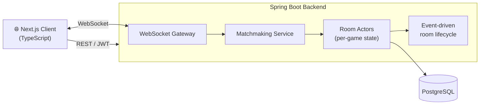

 

---

# 👋 Hi, I'm Long

**Backend engineer** based in **Ho Chi Minh City, Vietnam**, focused on **distributed systems**, **real-time services**, and **event-driven architecture**.

I enjoy solving backend problems where **reliability, performance, and architecture** matter more than fancy UI — designing clean APIs, modeling concurrent systems, and making services that stay correct under load.

My core stack is **Java · Spring Boot · Kafka · gRPC**, and I learn best by building things that run under production-like conditions.

---

# 🎯 Current Focus

<table>
<tr>
<td>

**Building**
- Real-time WebSocket services
- Event-driven backends with Kafka
- gRPC service-to-service communication

</td>
<td>

**Going deeper on**
- Distributed systems & system design
- Clean / Hexagonal Architecture
- Cloud native (Docker · Kubernetes · CI/CD)

</td>
</tr>
</table>

---

# 🚀 Featured Project — GoCaro

> **Real-time multiplayer Gomoku (Caro) backend** — an end-to-end system for live matches, not just a CRUD app.

**🔗 Live Demo:** https://go-caro-frontend.vercel.app

**What it does under the hood:**

- ⚡ **Real-time gameplay** over WebSocket (low-latency move sync)
- 🎯 **Matchmaking** — pairs players into live rooms
- 🧩 **Room Actor model** — each game room owns its own state & lifecycle
- 🔄 **Event-driven room lifecycle** — create → join → play → finish
- 🏛️ **Clean Architecture** — clear separation of domain / application / infra
- 🔐 **JWT authentication**
- 🗄️ **PostgreSQL** persistence

### Architecture

**Tech:** `Java` · `Spring Boot` · `WebSocket` · `Next.js` · `TypeScript` · `PostgreSQL`

---

# 🛠 Tech Stack

---

# 🧱 Things I Build

- ✅ High-throughput **REST & gRPC APIs**
- ✅ **Real-time WebSocket** services
- ✅ **Event-driven** backends with Kafka
- ✅ **Dockerized** deployments with CI/CD
- ✅ Clean, testable, well-architected services

---

# 🧠 Focus Areas

`Distributed Systems` · `Real-time Backend` · `Event-Driven Architecture` · `Clean Architecture` · `Cloud Native` · `Scalable APIs`

---

# 📈 GitHub Activity

 

  

---

### Thanks for stopping by! Let's connect.

