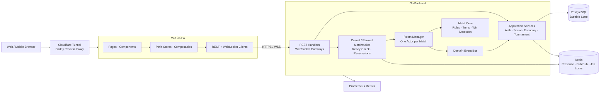

 

---

# 👋 Hi, I'm Long

I'm a **backend engineer** based in **Ho Chi Minh City, Vietnam**, focused on **distributed systems**, **real-time services**, and **event-driven architecture**.

I enjoy problems where correctness under concurrency, reliability, and system boundaries matter: designing clean APIs, isolating domain logic, coordinating live state, and operating services under production-like conditions.

My backend toolkit spans **Java / Spring Boot** and **Go**, with hands-on work across WebSockets, Kafka, gRPC, PostgreSQL, Redis, Docker, and CI/CD.

---

# 🎯 Current Focus

<table>
<tr>
<td valign="top" width="50%">

**Building**

- GoCaro, a production-minded real-time game platform
- Actor-style WebSocket services and event-driven workflows
- Social, tournament, progression, and virtual-economy systems

</td>
<td valign="top" width="50%">

**Going deeper on**

- Distributed systems and failure recovery
- Clean / Hexagonal Architecture
- Observability, abuse prevention, and cloud-native delivery

</td>
</tr>
</table>

---

# 🚀 Featured Project — GoCaro

## 🎮 Real-time Multiplayer Gomoku Platform

GoCaro has grown from a two-player WebSocket demo into a full multiplayer platform. Players can enter anonymously, upgrade their account without losing progress, compete in casual or ranked matches, reconnect after a dropped connection, join tournaments, challenge friends, chat, and build a spirit collection.

🌐 **Live:** [gocaro.cyou](https://gocaro.cyou) 
📦 **Source:** [Go backend](https://github.com/longtmb2003/GoCaro-Backend) · [Vue frontend](https://github.com/longtmb2003/GoCaro-Frontend)

**Backend:** `Go 1.26` · `Gin` · `gorilla/websocket` · `PostgreSQL / pgx` · `Redis` · `JWT` · `Prometheus` 
**Frontend:** `Vue 3` · `TypeScript` · `Pinia` · `Tailwind CSS 4` · `Vite 8`

### 🏛️ System Architecture

The core match state is owned by a **single room goroutine**. Commands enter through channels, the isolated `MatchCore` applies game rules, and immutable domain events fan out to persistence and realtime protocol adapters. This keeps the domain independent from HTTP, WebSocket, and database concerns while avoiding shared-state races inside a match.

### ⚡ Realtime & Competitive Play

- Casual FIFO and ranked Elo matchmaking with a widening rating band
- Match ready checks, abandonment penalties, turn clocks, draw offers, and resignations
- Reconnect and full state resync after transient disconnects
- Spectator mode, match history, replay, and shareable results
- Private friend challenges and open invite-code matches
- Single-elimination tournaments with brackets, round progression, walkovers, and recovery jobs

### 🤝 Social & Progression

- Anonymous play with an in-place upgrade to a permanent account
- Redis-backed presence, live lobby events, friends, user search, and activity feeds
- Lobby chat, direct messages, unread state, and retention cleanup
- Coins, daily quests, achievements, rank tiers, streaks, and leaderboards
- Shop, inventory, equipment, spirit collection, and spirit evolution

### 🛡️ Production Engineering

- PostgreSQL migrations and transactional persistence for matches, ratings, rewards, and tournament state
- Redis pub/sub, distributed background-job locks, and multi-instance-aware presence
- Per-IP and per-user rate limits plus optional Cloudflare Turnstile protection
- Liveness/readiness probes, structured logging, Prometheus metrics, and graceful shutdown
- Dockerized deployment behind Caddy and Cloudflare Tunnel
- **400+ Go test functions** across unit, repository, handler, concurrency, and end-to-end suites; CI also runs race detection

---

# 🛠 Tech Stack

  

---

# 🧱 What I Build

- Reliable REST, gRPC, and WebSocket services
- Concurrent systems with explicit state ownership and lifecycle management
- Event-driven backends and asynchronous workflows
- Data-intensive features backed by PostgreSQL and Redis
- Observable, containerized deployments with CI/CD
- Clean, testable systems with pragmatic architecture boundaries

---

# 🧠 Focus Areas

`Distributed Systems` · `Real-time Backend` · `Event-Driven Architecture` · `Concurrency` · `Clean Architecture` · `Observability` · `Cloud Native`

---

# 📈 GitHub Activity

---

### Thanks for stopping by — let's connect.

