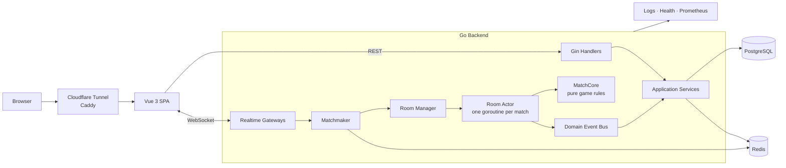
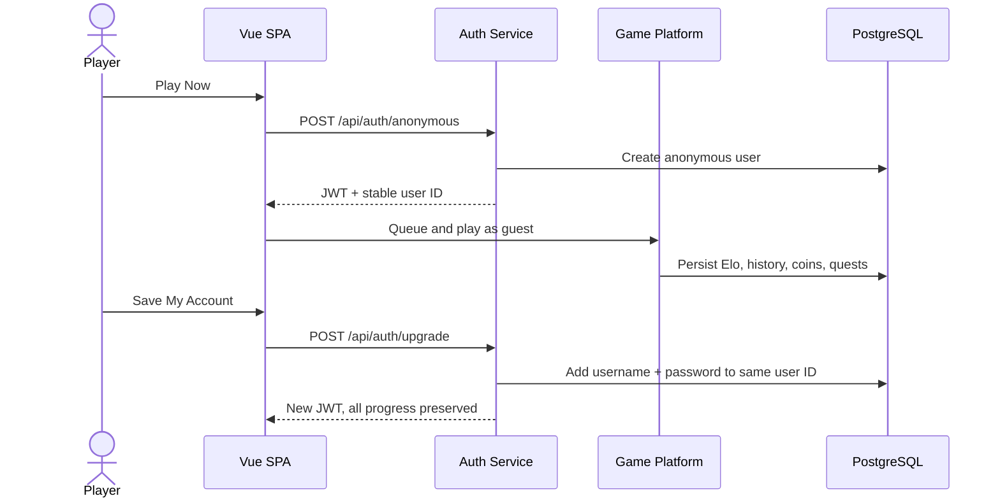
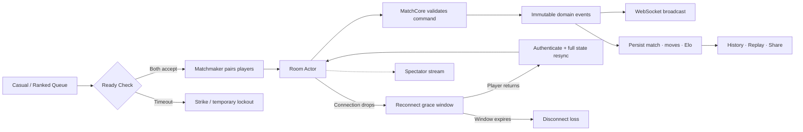
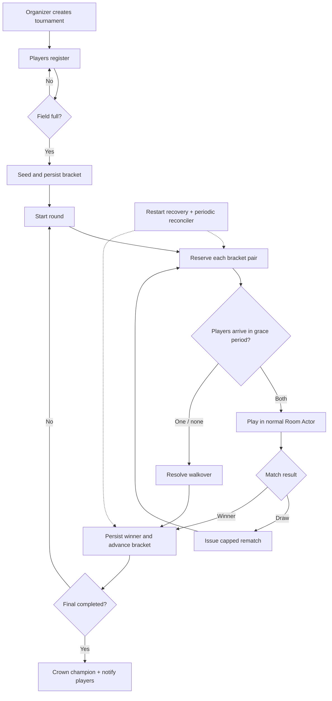
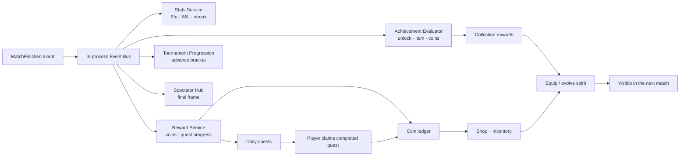

<h1>Long Tran</h1>
<h3>Backend Engineer · Real-time Systems · Distributed Architecture</h3>

I build backend systems that stay correct under concurrency, 
recover from failure, and remain understandable as they grow.

  
  
  

  
  
  
  
  

---

## 👋 About Me

I'm a backend engineer based in **Ho Chi Minh City, Vietnam**, focused on **distributed systems**, **real-time services**, and **event-driven architecture**. I enjoy designing explicit state ownership, clean service boundaries, durable data flows, and production safeguards—not just endpoints that work on the happy path.

My toolkit spans **Java / Spring Boot** and **Go**, with hands-on work across WebSockets, Kafka, gRPC, PostgreSQL, Redis, Docker, observability, and CI/CD.

---

## 🚀 Featured Project: GoCaro

### A production-minded real-time multiplayer Gomoku platform

  
  
  

GoCaro started as a two-player WebSocket demo and evolved into a complete multiplayer platform: instant guest play, ranked matchmaking, reconnect, spectators, tournaments, social features, chat, rewards, and collectible spirits—all backed by explicit concurrency and persistence rules.

| Realtime Core | Competition | Social Layer | Progression |
| --- | --- | --- | --- |
| Actor-owned matches | Casual + ranked queues | Redis presence | Elo ranks + streaks |
| Reconnect + resync | Ready checks | Friends + challenges | Coins + daily quests |
| Spectate + replay | Tournament brackets | Lobby + direct chat | Shop + spirit evolution |

**Backend:** `Go 1.26` · `Gin` · `gorilla/websocket` · `PostgreSQL / pgx` · `Redis` · `JWT` · `Prometheus` 
**Frontend:** `Vue 3` · `TypeScript` · `Pinia` · `Tailwind CSS 4` · `Vite 8`

### Architecture at a Glance

The important boundary is the **Room Actor**: one goroutine exclusively owns board state, clocks, disconnect state, and match lifecycle. Other components send commands through channels; they never mutate a live match directly.

---

## 🔀 Highlighted System Flows

### 1. Play Instantly, Keep the Same Identity

Anonymous play is a first-class account state, not a disposable frontend session. Upgrading changes credentials on the same user record, so Elo, history, coins, quests, and inventory survive.

### 2. Match Lifecycle, Reconnect, and Durable Results

The live path separates commands, domain rules, event delivery, and persistence. A transient network failure enters a grace window; a returning player receives a complete state snapshot before continuing.

### 3. Tournament Bracket from Registration to Champion

Tournament matches reuse the real matchmaker and room engine. The bracket persists independently from live reservations, so recovery can reissue work after a restart or reconcile a dropped event.

### 4. One Match Event Powers the Progression Loop

Match completion is published once. Ordered subscribers ensure stats are updated before rewards are calculated; other subscribers handle achievements, spectators, and tournament progression without adding those concerns to gameplay code.

---

## 🧠 Engineering Highlights

- **Explicit concurrency:** one goroutine owns each live match; no mutex protects board state.
- **Failure recovery:** reconnect snapshots, graceful shutdown, tournament recovery, and periodic reconciliation.
- **Durable workflows:** 27 versioned PostgreSQL migrations plus transactional match, rating, reward, and bracket writes.
- **Distributed coordination:** Redis-backed cross-node presence, pub/sub, and background-job locks.
- **Production safeguards:** per-IP/per-user limits, optional Turnstile, liveness/readiness probes, structured logs, and Prometheus metrics.
- **Proven behavior:** 400+ Go test functions across domain, handlers, repositories, concurrency, and end-to-end flows; CI runs vet, lint, and the race detector.

---

## 🛠 Technology Stack

  

| Area | Tools |
| --- | --- |
| Backend | Go, Java, Spring Boot, Gin, REST, gRPC, WebSockets |
| Data & Messaging | PostgreSQL, MySQL, MongoDB, Redis, Kafka |
| Frontend | Vue 3, TypeScript, Pinia, Tailwind CSS, Vite |
| Platform | Docker, Kubernetes, Caddy, Nginx, Cloudflare, GitHub Actions |

---

## 🎯 What I'm Exploring

`Distributed Systems` · `Real-time Backend` · `Event-Driven Architecture` · `Concurrency` · `Failure Recovery` · `Observability` · `Cloud Native`

---

## 📈 GitHub Activity

---

### Let's build something reliable.

