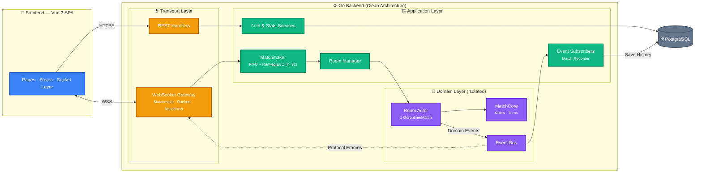

 

---

# 👋 Hi, I'm Long

**Backend engineer** based in **Ho Chi Minh City, Vietnam**, focused on **distributed systems**, **real-time services**, and **event-driven architecture**.

I enjoy solving backend problems where **reliability, performance, and architecture** matter more than fancy UI — designing clean APIs, modeling concurrent systems, and making services that stay correct under load.

My core stack is **Java · Spring Boot · Kafka · gRPC**, and I learn best by building things that run under production-like conditions.

---

# 🎯 Current Focus

<table>
<tr>
<td>

**Building**
- Real-time WebSocket services
- Event-driven backends with Kafka
- gRPC service-to-service communication

</td>
<td>

**Going deeper on**
- Distributed systems & system design
- Clean / Hexagonal Architecture
- Cloud native (Docker · Kubernetes · CI/CD)

</td>
</tr>
</table>

---

# 🚀 Featured Project — GoCaro
## 🎮 GoCaro — Real-time Multiplayer Gomoku (Caro)

An end-to-end system for **live online matches** — not a CRUD demo. Play instantly
as a guest, climb a ranked ELO ladder, and reconnect mid-game without losing.

🔗 **Live demo:** https://go-caro-frontend.vercel.app
📦 [Backend (Go)](https://github.com/longtmb2003/GoCaro-Backend) · [Frontend (Vue)](https://github.com/longtmb2003/GoCaro-Frontend)

**Stack** — Backend: `Go 1.26` · `Gin` · `gorilla/websocket` · `pgx/PostgreSQL` · `JWT` ·
Frontend: `Vue 3` · `TypeScript` · `Pinia` · `TailwindCSS` · `Vite`

### 🏛️ Architecture

> **Flow:** A WebSocket frame enters the gateway ➡️ the Matchmaker pairs players into a **Room Actor** ➡️ the room applies the move through **MatchCore** and emits **domain events** ➡️ the event bus fans them out to persistence and to the protocol mappers that push frames back to clients. The domain layer knows nothing about JSON or sockets.

### ⚙️ Backend — engineered for concurrency, not just endpoints
- ⚡ **Real-time gameplay over WebSocket** — low-latency move sync on a 15×15 board
- 🧩 **Actor-style rooms** — one goroutine per match owns its state, timers & lifecycle; no mutexes on game state
- 🔄 **Event-driven architecture** — commands in, domain events out over an internal event bus (persistence is just a subscriber)
- 🏛️ **Clean Architecture** — domain / application / transport strictly separated; the domain never imports networking
- 🎯 **Dual matchmaking** — casual FIFO queue, plus **ranked ELO** (K=32) with a rating band that widens the longer you wait
- 🔁 **Reconnect with a grace window** — a dropped player rejoins their live match and resyncs the board
- 👀 **Spectator mode** · 🎞️ **Replay** · ⏱️ **Turn clock** · 🤝 **Draw offers**
- 🔐 JWT auth · 🗄️ PostgreSQL persistence · ✅ **230 tests** (unit + e2e, race-checked in CI)

### 🖥️ Frontend — a full game client, not a shell
- 🚀 **Anonymous "Play Now"** — start a match in one click, **save your account later** without losing rating or history
- 🏆 **Player progression** — ELO rank tiers, win streaks, coins, daily missions & achievement sharing
- 📊 **Live lobby** — online-user presence, leaderboard preview & username search, match history
- ♻️ **Resilient in-match UX** — auto-reconnect overlay, opponent-away countdown, live turn timer
- ♿ Accessible, responsive, light/dark — built as Page → Component → Composable → Store → Socket layers

---

# 🛠 Tech Stack

---

# 🧱 Things I Build

- ✅ High-throughput **REST & gRPC APIs**
- ✅ **Real-time WebSocket** services
- ✅ **Event-driven** backends with Kafka
- ✅ **Dockerized** deployments with CI/CD
- ✅ Clean, testable, well-architected services

---

# 🧠 Focus Areas

`Distributed Systems` · `Real-time Backend` · `Event-Driven Architecture` · `Clean Architecture` · `Cloud Native` · `Scalable APIs`

---

# 📈 GitHub Activity

---

### Thanks for stopping by! Let's connect.

